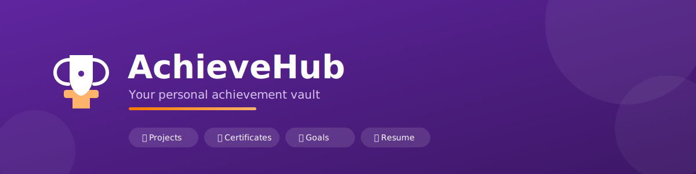

<p align="center">
  
</p>

# 🏆 AchieveHub

A personal achievement vault for students — track your portfolio, projects, certificates, and achievements in one place, then generate a polished resume in one click.

**🔗 Live demo:** [harika7075-achievehub-app-xlmese.streamlit.app](https://harika7075-achievehub-app-xlmese.streamlit.app/)

---

## 🎥 Demo

🎬 **Watch the demo:** [Click to play video](https://github.com/Harika7075/AchieveHub/raw/main/Untitled%20design%20(1).mp4)

---

## ✨ Features

- **Student Portfolio** — profile with bio, education, goals, skills, social links, custom accent color, and cover banner
- **Projects** — showcase projects with tech stack, GitHub/demo links, images, and multiple file attachments (PDFs, docs, zips)
- **Certificates** — log credentials with category tags, images, and attached files
- **Achievements** — track awards, competitions, publications, and milestones
- **Resume Generator** — auto-builds a resume from your data, with:
  - Classic & Modern PDF templates
  - Custom accent colors
  - Section toggles (include/exclude any section)
  - Save & revisit past resume versions
- **Detail pages** — full view for any project/certificate/achievement, with real file downloads (not just links)
- **Dark mode** toggle across every page
- **App-style home dashboard** — profile completeness tracker, quick-action tiles, recent activity feed

---

## 🛠 Tech Stack

- **Frontend:** [Streamlit](https://streamlit.io/) (multi-page app)
- **Backend / Database:** [Supabase](https://supabase.com/) (Postgres + Storage)
- **PDF generation:** [ReportLab](https://www.reportlab.com/)
- **Styling:** Custom CSS injected via `st.markdown`, Google Fonts (Sora + Inter)

---

## 📂 Project Structure

```
achievehub/
├── app.py                       # Home dashboard
├── pages/
│   ├── 1_certificates.py
│   ├── 2_projects.py
│   ├── 3_Portfolio.py
│   ├── 4_Achievements.py
│   ├── 5_Resume_Generator.py
│   └── 6_Details.py
└── .streamlit/
    └── secrets.toml             # Supabase credentials (not committed)
```

---

## ⚙️ Setup

1. Clone the repo:
   ```
   git clone https://github.com/Harika7075/AchieveHub.git
   cd AchieveHub
   ```

2. Install dependencies:
   ```
   pip install streamlit supabase reportlab requests
   ```

3. Create `.streamlit/secrets.toml`:
   ```toml
   SUPABASE_URL = "your-supabase-url"
   SUPABASE_KEY = "your-supabase-anon-key"
   ```

4. In Supabase, create these tables: `profiles`, `projects`, `certificates`, `achievements`, `resume_history`

5. In Supabase Storage, create these public buckets with insert/select policies for `anon`:
   `profile_images`, `certificate_images`, `project_images`, `achievement_images`, `project_files`, `certificate_files`, `resumes`

6. Run the app:
   ```
   streamlit run app.py
   ```

---

## 🏷️ Built With


## 🚀 At a Glance

| | |
|---|---|
| 🎓 **Built for** | Students tracking their academic journey |
| 🗂️ **Core modules** | Portfolio · Projects · Certificates · Achievements · Resume Generator |
| 📄 **Resume output** | Auto-generated PDF, 2 templates, custom accent colors |
| ☁️ **Storage** | All images & files in Supabase Storage — nothing lost on redeploy |
| 🌗 **Theming** | Light / Dark mode on every page |
| 🔍 **Detail pages** | Real file downloads, not just links |

---

## 🙋‍♀️ Author

Built by [Harika](https://github.com/Harika7075) — a student project to learn full-stack app development with Streamlit and Supabase.
    
